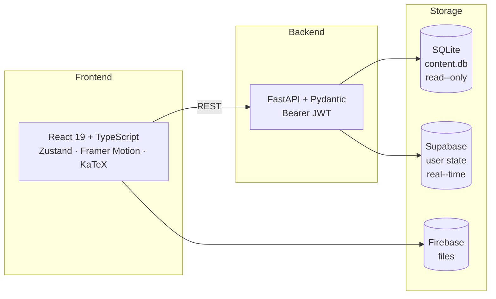
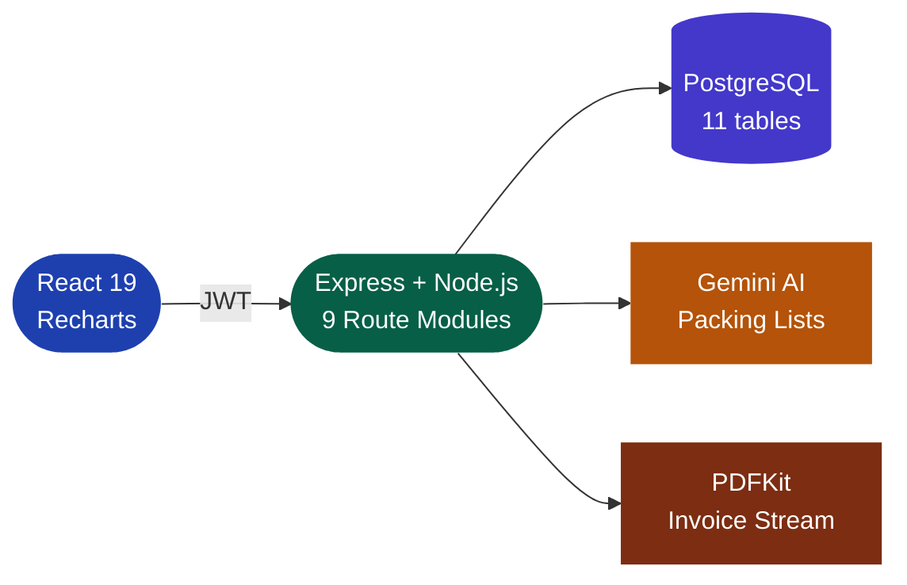

<!-- HEADER -->

  

 

Computer Science student focused on backend systems, database engineering, and workflow automation. 
I design systems where data models, workflows, and state transitions are first-class citizens.

 

---

## 🔨 What I Build

<table width="100%">
<tr>
<td align="center" width="25%">

**Inventory · Orders** 
Workflow Automation

</td>
<td align="center" width="25%">

**Schema Design** 
SQL · Query Planning

</td>
<td align="center" width="25%">

**Auth · RBAC** 
API Architecture

</td>
<td align="center" width="25%">

**Learning Systems** 
Progress · AI Tools

</td>
</tr>
</table>

 

**Currently Deepening**

&nbsp;
&nbsp;
&nbsp;
&nbsp;

---

## ⚡ Engineering Snapshot

| | |
|--|--|
|  | 22-table relational model · 4 database views · event-driven stock ledger |
|  | 30+ endpoints across 9 route modules · JWT-authenticated throughout |
|  | JWT Access + Refresh token pair · RBAC at controller layer |
|  | Sales → Inventory Reservation → Manufacturing Order → Work Orders → Stock Ledger |
|  | Hybrid SQLite + Supabase · FastAPI + Node.js + Express backends |
|  | B.Tech CSE · Parul University · 2025–2029 · CGPA 7.85 |

---

## 🛠️ Technical Stack

**Backend Engineering**

&nbsp;
&nbsp;
&nbsp;
&nbsp;
&nbsp;

**Database Systems**

&nbsp;
&nbsp;
&nbsp;
&nbsp;

**Frontend Systems**

&nbsp;
&nbsp;
&nbsp;
&nbsp;
&nbsp;
&nbsp;

**Languages**

&nbsp;
&nbsp;
&nbsp;
&nbsp;
&nbsp;

**Infrastructure**

&nbsp;
&nbsp;
&nbsp;
&nbsp;

---

## 🔍 System Design Interests

&nbsp;
&nbsp;
&nbsp;
&nbsp;
&nbsp;
&nbsp;

## 🧭 Engineering Principles

| | |
|--|--|
|  | Database and relationships designed before any API or UI work begins |
|  | Business processes modeled as explicit, auditable state machines |
|  | Business logic anchored in the data layer, not scattered across application code |
|  | No implicit state changes — every transition is intentional and recorded |
|  | Complete audit trails preferred; every state change leaves a permanent record |

---

## 🏗️ Projects

 

### 🏭 B-Cart — Manufacturing ERP

> ERP-style business workflow architecture · Hackathon build

**Problem:** No single system tracks the complete order-to-stock workflow — the result is manual handoffs between teams, concurrent overselling, and no audit trail.

| | |
|--|--|
|  | 22 PostgreSQL tables · 4 views · Moving Average Costing · Normalized across 8 domains |
|  | Inventory Reservation Engine · Manufacturing Order automation · Work Order state machine |
|  | Event-driven · every movement immutable · full history reconstructable |
|  | JWT Access + Refresh · RBAC at controller layer · Full audit logging |

**Technical Decisions**

| Decision | Reasoning |
|----------|-----------|
| **PostgreSQL** | Relational integrity non-negotiable — FK constraints prevent data corruption at DB level |
| **Event-Driven Ledger** | Immutable events enable audit trail and historical reconstruction without destructive updates |
| **Moving Average Costing** | Industry-standard valuation; compatible with real manufacturing accounting workflows |
| **Access + Refresh JWT** | Short-lived access tokens bound the compromise window without server-side session state |
| **RBAC at controller** | Frontend authorization is cosmetic; enforced server-side on every request |

&nbsp;
&nbsp;
&nbsp;
&nbsp;
&nbsp;

<!-- 🔗 [Repository](#ADD-LINK) · [Schema Diagram](#ADD-LINK) · [API Docs](#ADD-LINK) -->

 

---

### 📚 ExamForge — Enterprise GATE Preparation Platform

> Monorepo · Separate React frontend + FastAPI backend

**Problem:** GATE prep needs near-instant question access (read-heavy, offline-capable) and real-time cross-device sync (write-heavy, live) — a single database cannot optimize both simultaneously.

| | |
|--|--|
|  | Thousands of GATE questions · read-only · sub-millisecond · zero network overhead |
|  | Progress · streaks · quiz state synced live across all devices via real-time subscriptions |
|  | Typed + validated API · strict Pydantic schemas · Bearer JWT auth |
|  | GitHub Actions on every push · Vercel zero-config deployment |
|  | LaTeX rendering required for GATE-level engineering and maths formulas |

**Technical Decisions**

| Decision | Reasoning |
|----------|-----------|
| **SQLite for content** | Questions never change at runtime; local SQLite eliminates all network round-trips |
| **Supabase for user state** | Real-time subscriptions give cross-device sync without client-side polling |
| **TypeScript strict** | Complex quiz state and spaced repetition logic; runtime type errors are silent |
| **Hybrid architecture** | No single DB optimizes both access patterns; split by workload type |
| **Monorepo** | Shared types and docs between React frontend and FastAPI backend |

&nbsp;
&nbsp;
&nbsp;
&nbsp;
&nbsp;
&nbsp;
&nbsp;
&nbsp;

🔗 [Frontend](https://github.com/aryanf192811-eng/examforgee) &nbsp;·&nbsp; [Backend](https://github.com/aryanf192811-eng/examforge-backend)

 

---

### ✈️ Traveloop — Trip Lifecycle Management System

> Full-stack · AI integration · PDF pipeline

**Problem:** Trip planning is fragmented — budgets in spreadsheets, itineraries in notes apps, invoices in email. No system connects the full lifecycle of a trip end-to-end with a shared data model.

| | |
|--|--|
|  | 11-table PostgreSQL model · 25 seeded cities · 57+ activity mappings · raw SQL |
|  | 30+ endpoints · Express mergeParams · consistent `{success, data, meta}` envelope |
|  | Gemini packing lists with offline fallback — app stays functional without API key |
|  | Server-side invoice generation via PDFKit · streamed as blob to client |
|  | JWT + bcrypt · Multer photo uploads · Role-aware admin analytics panel |

**Technical Decisions**

| Decision | Reasoning |
|----------|-----------|
| **Raw SQL** | Explicit query control; ORM abstractions hide what actually runs against the database |
| **Express mergeParams** | Nested router pattern keeps route files domain-separated and maintainable |
| **Server-side PDF** | No client-side library weight; invoices generated fresh on each request |
| **Gemini with fallback** | AI features degrade gracefully; core trip management works without any API key |
| **Express over Fastify** | Broader ecosystem for Multer and PDFKit adapter patterns needed here |

&nbsp;
&nbsp;
&nbsp;
&nbsp;
&nbsp;
&nbsp;

🔗 [Repository](https://github.com/aryanf192811-eng/Pizza-Traveloop)

---

## 💼 Experience & Achievements

**Full-Stack Web Consultant — SoundRich Hearing** *(2026 · Freelance · Delhi NCR)*

- Audited clinic website — identified UX gaps and SEO improvement opportunities
- Built redesigned inquiry and appointment booking prototype from scratch
- Managed complete client communication and delivery pipeline independently

 

| | Achievement | When |
|--|-------------|------|
| 🥇 | **Final Round** — Odoo × Parul University Hackathon 2026 | Semester 2 |
| 💼 | **Paid freelance engagement** — SoundRich Hearing | Semester 2 |
| 📜 | Certifications: HTML · CSS · JavaScript · Full-Stack Architecture & System Design | — |

---

## 📊 GitHub Stats

  
  

---

## 📫 Connect

  &nbsp;
  &nbsp;
  <!-- UPDATE: LinkedIn URL -->
  <!-- &nbsp; -->
  <!-- UPDATE: Portfolio URL -->
  <!-- &nbsp; -->
  <!-- UPDATE: Hosted resume PDF -->
  <!--  -->

  

<!-- FOOTER WAVE -->

<!--
  ┌──────────────────────────────────────────────────────────────────┐
  │                    MAINTAINER UPDATE GUIDE                       │
  ├──────────────────────────────────────────────────────────────────┤
  │  B-Cart repo    → Fill commented repo/schema/api-docs links     │
  │  Spring Boot    → Move to main stack when actively shipping      │
  │  Connect        → Uncomment LinkedIn · Portfolio · Resume        │
  │  Snapshot       → Update metrics as projects grow               │
  │  Principles     → Expand as engineering thinking matures        │
  │  Traveloop      → Add architecture docs + schema diagram to repo │
  └──────────────────────────────────────────────────────────────────┘
-->
