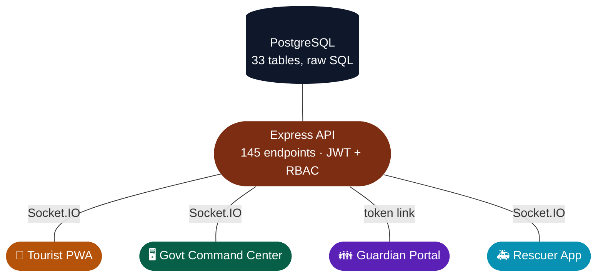
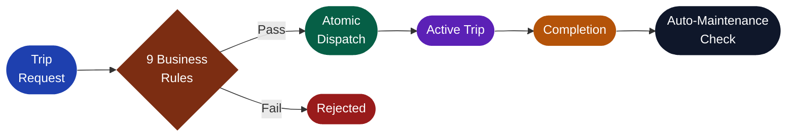
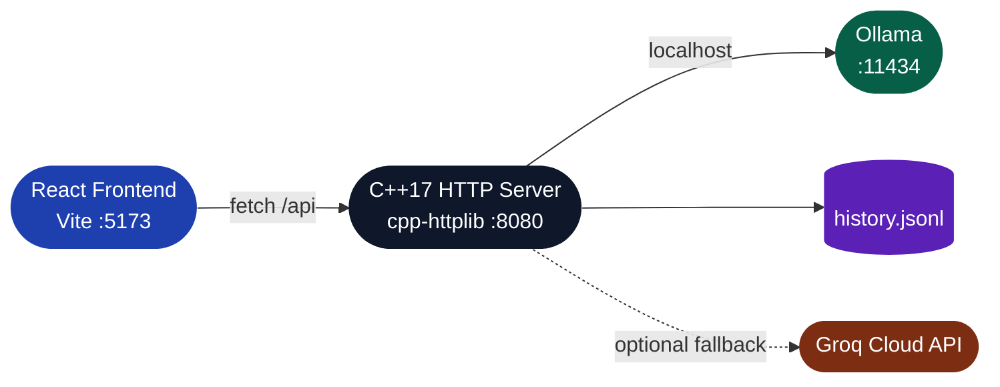
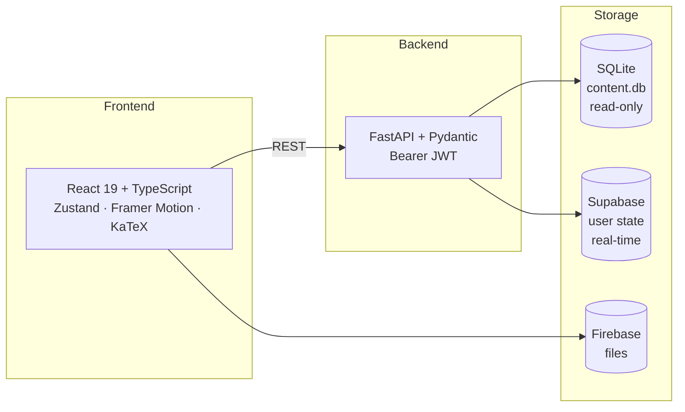
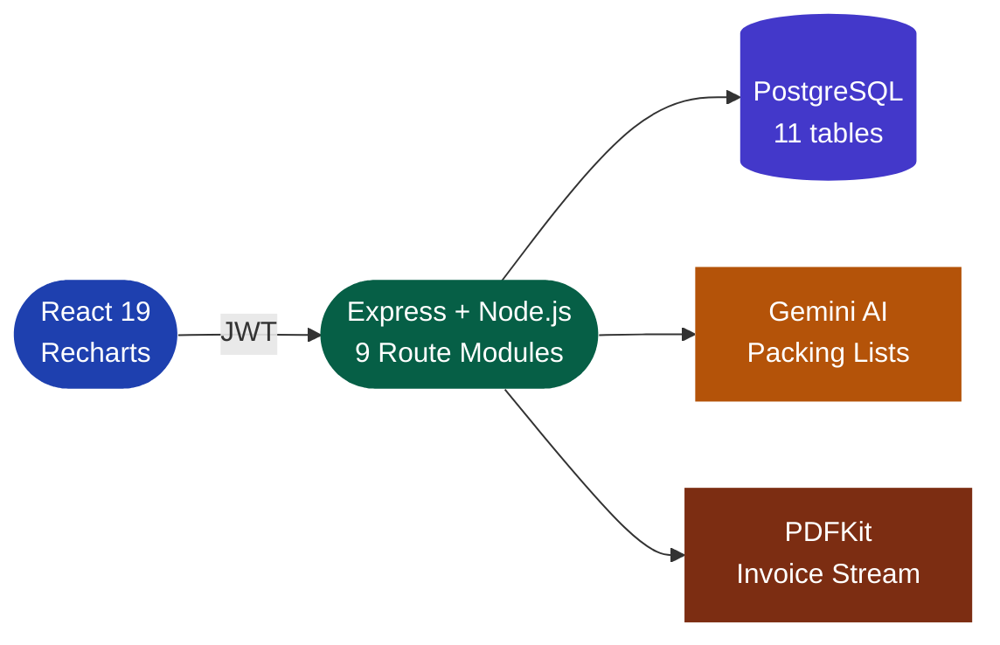
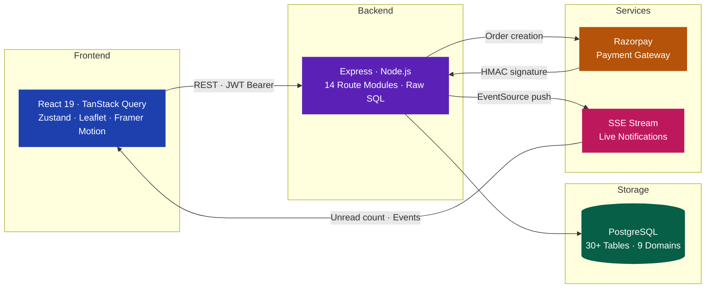

<!-- HEADER -->

  

B.Tech CSE · Parul University · 2025–2029 
Backend systems, database engineering, and workflow automation. 
I design systems where data models, workflows, and state transitions are first-class citizens.

---

## ⚡ GitHub Activity

<!-- Activity graph — area fill, tokyo-night theme. Reliably loads for all account sizes -->

  

<!-- Streak (demolab — confirmed working) + Language stats in one row -->

  
  &nbsp;
  

  

  <!--  -->

<!-- 
  CONTRIBUTION SNAKE — requires one-time GitHub Actions setup:

  1. In your profile repo (aryanf192811-eng/aryanf192811-eng), create:
     .github/workflows/snake.yml  ← file included in this repo's /extras/ folder

  2. Go to repo Settings → Actions → General → set "Workflow permissions" to Read and Write

  3. Run the workflow manually once from the Actions tab

  4. After it completes, uncomment the line below:
-->
<!--  -->
   
---

## 🛠️ Technical Stack

<table align="center">
<tr>
<td align="center" width="120px"><b>Backend</b></td>
<td>

</td>
</tr>
<tr>
<td align="center"><b>Database</b></td>
<td>

</td>
</tr>
<tr>
<td align="center"><b>Frontend</b></td>
<td>

</td>
</tr>
<tr>
<td align="center"><b>Languages</b></td>
<td>

</td>
</tr>
<tr>
<td align="center"><b>Tools</b></td>
<td>

</td>
</tr>
</table>

  &nbsp;
  &nbsp;
  &nbsp;
  

---

## 🧭 Engineering Principles

| Principle | In Practice |
|-----------|-------------|
| **Schema-First** | Database schema and relationships designed before any API or UI work begins |
| **Workflow-Driven** | Business processes modeled as explicit, auditable state transitions — not implicit side effects |
| **Auditability** | Every state change leaves a permanent record; no destructive updates where event sourcing fits |

---

## 🏗️ Projects

 

### 🛡️ Aaraksha — Smart Tourism, Safe Journey  ⭐ Flagship

> Smart India Hackathon 2026 · Student Innovation · Travel & Tourism theme
> An AI-Native Travel Planning, Verified Local Tourism Discovery, and Offline-Resilient Safety Platform for Northeast Indian Terrain

**Problem:** Northeast India pulls a growing number of tourists into terrain most tourism and safety apps were never built for — 3000m mountain passes, zero-connectivity valleys, and a local tourism economy with almost no digital presence a traveller can trust. Existing tourism apps stop at itinerary planning; existing safety apps assume a phone signal.

```mermaid
flowchart TB
    DB[(PostgreSQL\n33 tables, raw SQL)] --- API([Express API\n145 endpoints · JWT + RBAC])
    API ---|Socket.IO| T([🧭 Tourist PWA])
    API ---|Socket.IO| G([🖥️ Govt Command Center])
    API ---|token link| F([👪 Guardian Portal])
    API ---|Socket.IO| R([🚑 Rescuer App])
    style DB fill:#0f172a,color:#fff,stroke:none
    style API fill:#7c2d12,color:#fff,stroke:none
    style T fill:#b45309,color:#fff,stroke:none
    style G fill:#065f46,color:#fff,stroke:none
    style F fill:#5b21b6,color:#fff,stroke:none
    style R fill:#0891b2,color:#fff,stroke:none
```

| | |
|--|--|
|  | Tourist PWA · Govt Command Center · Guardian (no-login) · Rescuer App — one real-time data model |
|  | 18 route groups, Route → Middleware → Controller → Service → Repository |
|  | From-scratch logistic regression — no scikit-learn, no TensorFlow — 75.6% test accuracy, explainable per-prediction |
|  | SOS over raw SMS with zero data connection — a Twilio webhook does the rest |
|  | A real SHA-256 hash chain over every check-in, SOS event, and govt checkpoint scan — independently recomputable |
|  | Rate-limit bypass attempts, SQLi payloads, concurrent double-resolve races — each found, fixed, re-verified live |

**Technical Decisions**

| Decision | Reasoning |
|----------|-----------|
| **A rescue handoff verification code** | HMAC-hashed, 3-attempt lockout, checked against 250m GPS proximity — a rescuer has to physically reach the tourist to close a case, not just claim it by radio |
| **Rule-based TSI alongside a trained ML model, both labeled honestly** | A rule-based Travel Safety Index recalculated hourly from live weather, and a separate, genuinely trained Predictive Risk Score — neither pretends to be the other |
| **Dead Man's Switch** | The safety layer's core assumption is the opposite of most apps: the moment someone needs help is exactly when their phone stops being reliable |
| **Government-verified local tourism directory, not a booking platform** | A discovery/trust layer solves what's actually missing — a real hotel/guide being discoverable — without building a much larger, out-of-scope OTA clone |
| **DPDP Act 2023 data rights, not a slide-deck paragraph** | A tourist can export or request deletion of their own data — anonymized in place, never a raw DELETE, so legally-retainable SOS/E-FIR history survives |

&nbsp;
&nbsp;
&nbsp;
&nbsp;
&nbsp;
&nbsp;
&nbsp;
&nbsp;
&nbsp;
&nbsp;

🔗 [Repository](https://github.com/aryanf192811-eng/Aaraksha)

 

---

### 🚛 LEVO — Smart Transport Operations Platform

> Production-grade fleet & logistics · 9-rule atomic dispatch engine

**Problem:** Fleet operators need dispatch decisions that are safe under concurrency — two dispatchers assigning the same vehicle at the same moment, or dispatching an in-shop vehicle, are real failure modes a naive Express+Postgres app doesn't prevent by default.

```mermaid
flowchart LR
    A([Trip\nRequest]) --> B{9 Business\nRules}
    B -->|Pass| C([Atomic\nDispatch])
    B -->|Fail| D([Rejected])
    C --> E([Active Trip])
    E --> F([Completion])
    F --> G([Auto-Maintenance\nCheck])
    style A fill:#1e40af,color:#fff,stroke:none
    style B fill:#7c2d12,color:#fff,stroke:none
    style C fill:#065f46,color:#fff,stroke:none
    style D fill:#991b1b,color:#fff,stroke:none
    style E fill:#5b21b6,color:#fff,stroke:none
    style F fill:#b45309,color:#fff,stroke:none
    style G fill:#0f172a,color:#fff,stroke:none
```

| | |
|--|--|
|  | 9 strict business rules enforced atomically via `prisma.$transaction` — zero race-condition dispatches |
|  | 11 PostgreSQL models · 6 enums · Prisma ORM |
|  | 4 roles (Fleet Manager, Dispatcher, Safety Officer, Financial Analyst) enforced on every route |
|  | Grok (xAI) + OpenWeather — hourly risk reassessment of every active trip via node-cron |
|  | 40+ REST endpoints across 9 Express routers |

**Technical Decisions**

| Decision | Reasoning |
|----------|-----------|
| **Prisma transactions for dispatch** | 9 business rules must pass or fail atomically — partial application would leave the fleet in an inconsistent state |
| **node-cron hourly weather reassessment** | Trip risk isn't static once dispatched; live weather can change mid-trip and needs to surface to dispatchers automatically |
| **RBAC at 4 distinct roles** | Fleet operations separate concerns (dispatch vs. safety vs. finance) that a single "admin" role would blur |
| **Auto-maintenance on trip completion** | Service thresholds crossed during a trip should flag a vehicle before the next dispatch, not rely on a human remembering |

&nbsp;
&nbsp;
&nbsp;
&nbsp;
&nbsp;
&nbsp;
&nbsp;

🔗 [Repository](https://github.com/aryanf192811-eng/LEVO)

 

---

### 💰 PeoplePay360 — Explainable HR & Payroll Engine

> Odoo Hackathon 2026 · Top 50 Zonal Finalist of 857 teams (from 20,000+ registrations)

**Problem:** Payroll needs contracts, schedules, attendance, and leave to agree at once before a single payslip can be trusted — most HR tools store these as disconnected records.

```mermaid
flowchart LR
    A([Employee]) --> B([Contract\nPeriod-Scoped])
    B --> C([Payrun\nWizard])
    C --> D([Salary Rule\nEngine])
    D --> E([Payslip\nFrozen at Compute])
    E --> F([Payslip Diff /\nWhat-If Simulator])
    style A fill:#1e40af,color:#fff,stroke:none
    style B fill:#5b21b6,color:#fff,stroke:none
    style C fill:#7c2d12,color:#fff,stroke:none
    style D fill:#065f46,color:#fff,stroke:none
    style E fill:#b45309,color:#fff,stroke:none
    style F fill:#714b67,color:#fff,stroke:none
```

| | |
|--|--|
|  | No two overlapping active contracts per employee — enforced at the DB level, not app-level hope |
|  | Leave/payslip totals always computed live from real rows, never a field a form can silently overwrite |
|  | Gemini-backed assistant scoped strictly to the same aggregate JSON the Dashboard shows — never decides anything |
|  | Dry-runs the real payroll engine and unconditionally rolls back — no separate "fake" calculation path |
|  | Enforced at nav, route, and middleware layers — the last two are the actual security boundary |

**Technical Decisions**

| Decision | Reasoning |
|----------|-----------|
| **Raw PERN, zero ORM** | Every layer has a real, explainable answer — payroll correctness isn't something to trust to ORM abstraction |
| **Contracts never edited in place** | A raise is a new contract row; the old one stays correct for historical payslips |
| **Frozen payslip lines** | Editing a Salary Rule afterward changes future payruns only — past payslips stay exactly as computed |
| **Statistical anomaly detection** | A real population mean + stddev catches genuine outliers, not a hardcoded threshold that produces false positives |

&nbsp;
&nbsp;
&nbsp;
&nbsp;
&nbsp;
&nbsp;

🔗 [Repository](https://github.com/aryanf192811-eng/pay360)

 

---

### 🖥️ CodeVerter — Local-First AI Code Converter

> 26 languages · 100% local LLM · zero cloud, zero API keys, zero telemetry

**Problem:** Cloud-based code-conversion tools mean sending proprietary code to a third party and paying per call. This started as an AWS Lambda function with a hardcoded API key — rebuilt from the ground up so nothing leaves the machine by default.

```mermaid
flowchart LR
    A([React Frontend\nVite :5173]) -->|fetch /api| B([C++17 HTTP Server\ncpp-httplib :8080])
    B -->|localhost| C([Ollama\n:11434])
    B --> D[(history.jsonl)]
    B -.optional fallback.-> E([Groq Cloud API])
    style A fill:#1e40af,color:#fff,stroke:none
    style B fill:#0f172a,color:#fff,stroke:none
    style C fill:#065f46,color:#fff,stroke:none
    style D fill:#5b21b6,color:#fff,stroke:none
    style E fill:#7c2d12,color:#fff,stroke:none
```

| | |
|--|--|
|  | Self-contained C++17 server vendors its only two deps as single headers — no package manager needed |
|  | Converted code fills in token-by-token instead of waiting on one blocking response |
|  | Actually executes both source and converted code locally and diffs real output — real evidence, not plausible-looking code |
|  | A second local LLM call rates Big-O time/space complexity with severity-colored badges |
|  | Groq only triggers if Ollama is unreachable, with a visible banner whenever a conversion leaves the machine |

**Technical Decisions**

| Decision | Reasoning |
|----------|-----------|
| **C++17 + cpp-httplib** | A single compiled binary with no runtime dependency tree — the whole point is nothing to install beyond a compiler |
| **Ollama over a cloud API by default** | The original version leaked a hardcoded API key; local inference removes the entire class of problem |
| **SSE over WebSockets** | One-directional server→client token stream doesn't need WebSocket's bidirectional complexity |
| **Run & Compare with a hard timeout** | A runaway converted snippet shouldn't hang the backend — auto-probed local runtimes, 10s kill switch |

&nbsp;
&nbsp;
&nbsp;
&nbsp;
&nbsp;

🔗 [Repository](https://github.com/aryanf192811-eng/codeverter)

 

---

### 🏭 B-Cart — Manufacturing ERP

> Hackathon build · ERP-style business workflow architecture

**Problem:** No single system tracks the complete order-to-stock workflow — the result is manual handoffs between teams, concurrent overselling, and no audit trail when something goes wrong.

```mermaid
flowchart LR
    A([Sales\nOrder]) --> B([Inventory\nReservation])
    B --> C([Manufacturing\nOrder])
    C --> D([Work Order\nLifecycle])
    D --> E([Stock Ledger\nEvent])
    style A fill:#1e40af,color:#fff,stroke:none
    style B fill:#5b21b6,color:#fff,stroke:none
    style C fill:#be185d,color:#fff,stroke:none
    style D fill:#b45309,color:#fff,stroke:none
    style E fill:#065f46,color:#fff,stroke:none
```

| | |
|--|--|
|  | 22 PostgreSQL tables · 4 views · Moving Average Costing · normalized across 8 domains |
|  | Inventory Reservation Engine · Manufacturing Order automation · Work Order state machine |
|  | Event-driven · every movement immutable · full history reconstructable from event log |
|  | JWT Access + Refresh pair · RBAC at controller layer · full audit logging |

**Technical Decisions**

| Decision | Reasoning |
|----------|-----------|
| **PostgreSQL** | FK constraints enforce relational integrity at the DB level, independent of application code |
| **Event-Driven Stock Ledger** | Immutable events allow full audit trail and historical reconstruction without destructive updates |
| **Moving Average Costing** | Industry-standard inventory valuation; compatible with real manufacturing accounting workflows |
| **Access + Refresh JWT** | Short-lived access tokens limit compromise blast radius without server-side session storage |
| **RBAC at controller** | Authorization enforced server-side on every request — frontend checks serve as UI hints only |

&nbsp;
&nbsp;
&nbsp;
&nbsp;
&nbsp;

🔗 [Repository](https://github.com/aryanf192811-eng/B-cart)

 

---

### 📚 ExamForge — GATE Preparation Platform

> Monorepo · React frontend + FastAPI backend · Hybrid storage architecture

**Problem:** GATE prep has two conflicting access patterns — near-instant question access (read-heavy, ideally offline) and real-time cross-device progress sync (write-heavy, live). A single database optimizes for neither simultaneously.

```mermaid
flowchart LR
    subgraph Client [" Frontend "]
        A[React 19 + TypeScript\nZustand · Framer Motion · KaTeX]
    end
    subgraph Server [" Backend "]
        B[FastAPI + Pydantic\nBearer JWT]
    end
    subgraph Storage [" Storage "]
        C[(SQLite\ncontent.db\nread-only)]
        D[(Supabase\nuser state\nreal-time)]
        E[(Firebase\nfiles)]
    end
    A -->|REST| B
    B --> C
    B --> D
    A --> E
```

| | |
|--|--|
|  | Thousands of GATE questions · read-only · sub-millisecond · zero network overhead |
|  | Progress, streaks, and quiz state synced live across all devices via real-time subscriptions |
|  | Typed + validated API · strict Pydantic schemas · Bearer JWT auth |
|  | GitHub Actions on every push · Vercel zero-config deployment |
|  | LaTeX rendering for GATE-level engineering and math formula display |

**Technical Decisions**

| Decision | Reasoning |
|----------|-----------|
| **SQLite for content** | Question bank never changes at runtime — local SQLite eliminates all network latency on reads |
| **Supabase for user state** | Real-time subscriptions give cross-device sync without client-side polling overhead |
| **TypeScript strict mode** | Complex quiz state and spaced repetition logic make silent runtime type errors expensive to debug |
| **Split storage by workload** | No single database optimizes both read-heavy content access and write-heavy real-time sync |
| **Monorepo** | Shared types and documentation between React frontend and FastAPI backend stay consistent automatically |

&nbsp;
&nbsp;
&nbsp;
&nbsp;
&nbsp;
&nbsp;
&nbsp;
&nbsp;

🔗 [Frontend](https://github.com/aryanf192811-eng/examforgee) &nbsp;·&nbsp; [Backend](https://github.com/aryanf192811-eng/examforge-backend)

 

---

### ✈️ Traveloop — Trip Lifecycle Management

> Full-stack · AI integration · Server-side PDF pipeline

**Problem:** Trip planning is fragmented across spreadsheets, notes apps, and email. No system connects the full lifecycle — budget, itinerary, and invoicing — under a single shared data model.

```mermaid
flowchart LR
    A([React 19\nRecharts]) -->|JWT| B([Express + Node.js\n9 Route Modules])
    B --> C[(PostgreSQL\n11 tables)]
    B --> D[Gemini AI\nPacking Lists]
    B --> E[PDFKit\nInvoice Stream]
    style A fill:#1e40af,color:#fff,stroke:none
    style B fill:#065f46,color:#fff,stroke:none
    style C fill:#4338ca,color:#fff,stroke:none
    style D fill:#b45309,color:#fff,stroke:none
    style E fill:#7c2d12,color:#fff,stroke:none
```

| | |
|--|--|
|  | 11-table PostgreSQL model · 25 seeded cities · 57+ activity mappings · raw SQL throughout |
|  | 30+ endpoints · Express mergeParams · consistent `{success, data, meta}` response envelope |
|  | Gemini packing lists with offline fallback — core trip management stays functional without API key |
|  | Server-side invoice generation via PDFKit · streamed as blob directly to client |

**Technical Decisions**

| Decision | Reasoning |
|----------|-----------|
| **Raw SQL** | Direct query control; query execution is explicit and visible rather than inferred from ORM abstractions |
| **Express mergeParams** | Nested router pattern keeps route files domain-separated without losing parent route params |
| **Server-side PDF** | No client-side library weight; invoices generated fresh per request from authoritative data |
| **Gemini with fallback** | AI features degrade gracefully — the app remains fully usable without any external API key |

&nbsp;
&nbsp;
&nbsp;
&nbsp;
&nbsp;
&nbsp;

🔗 [Repository](https://github.com/aryanf192811-eng/Pizza-Traveloop)

 

---

### 🎓 Latent — Campus Social Platform

> Full-stack · Real-time SSE · Payment Gateway · Interactive Map

**Problem:** A 50,000-student campus communicates across 400+ WhatsApp groups, uses physical mess tokens in 2026, and has a 117-acre campus with no unified digital layer — no map, no social feed, no shared platform for clubs, events, or community.

```mermaid
flowchart LR
    subgraph Client [" Frontend "]
        A[React 19 · TanStack Query\nZustand · Leaflet · Framer Motion]
    end
    subgraph API [" Backend "]
        B[Express · Node.js\n14 Route Modules · Raw SQL]
    end
    subgraph DB [" Storage "]
        C[(PostgreSQL\n30+ Tables · 9 Domains)]
    end
    subgraph Ext [" Services "]
        D[Razorpay\nPayment Gateway]
        E[SSE Stream\nLive Notifications]
    end
    A -->|REST · JWT Bearer| B
    B --> C
    B -->|Order creation| D
    D -->|HMAC signature| B
    B -->|EventSource push| E
    E -->|Unread count · Events| A
    style A fill:#1e40af,color:#fff,stroke:none
    style B fill:#5b21b6,color:#fff,stroke:none
    style C fill:#065f46,color:#fff,stroke:none
    style D fill:#b45309,color:#fff,stroke:none
    style E fill:#be185d,color:#fff,stroke:none
```

| | |
|--|--|
|  | 30+ PostgreSQL tables · 9 domain modules · JSONB for image arrays, poll options, user interests |
|  | JWT · bcrypt · OTP forgot-password full flow · 401 auto-logout propagated to all connected clients |
|  | SSE stream · unread count push · 30s heartbeat keepalive · EventSource auto-reconnect |
|  | Razorpay order → client checkout → HMAC signature verification on backend → QR ticket issued |
|  | 38 GPS-verified locations from official 2026 campus PDF · crowd levels · dual campus polygons |

**Technical Decisions**

| Decision | Reasoning |
|----------|-----------|
| **30-table relational schema** | Posts, reactions, polls, clubs, events, mess, and map all cross-reference each other — FK integrity at the DB layer prevents data corruption independent of application code |
| **SSE over WebSockets** | Notification delivery is strictly server → client; SSE is HTTP-native, reconnects automatically, and avoids WebSocket upgrade issues in proxied environments |
| **HMAC payment verification on backend** | Frontend payment confirmation is trivially spoofable; HMAC checked server-side before any ticket row is written |
| **6-table join for feed query** | Aggregating reaction counts, comment counts, poll data, save status, and user vote in one query avoids N+1; doing this via ORM produces either N+1 or unmaintainable query chains |
| **TanStack Query v5** | Optimistic reaction updates, infinite scroll, and stale-while-revalidate require non-trivial cache management — centralizing this avoids duplicating it across every component |
| **Zustand + persist** | Auth is the only true client-side global in this codebase; a full Redux store would be significant overhead for a single slice |

&nbsp;
&nbsp;
&nbsp;
&nbsp;
&nbsp;
&nbsp;
&nbsp;

🔗 [Repository](https://github.com/aryanf192811-eng/latent) &nbsp;·&nbsp; [Demo](https://drive.google.com/file/d/1ch8jEU1LbNl-YH6gKiY0ZaU6G7j_l7yL/view?usp=sharing)

---

## 💼 Experience & Achievements

**Full-Stack Web Consultant — SoundRich Hearing** *(2026 · Freelance · Delhi NCR)*
- Audited existing clinic website and identified UX and SEO gaps
- Built redesigned inquiry and appointment booking interface from scratch
- Handled client communication and delivery pipeline end to end

 

**🏆 Honors & Awards**

| | |
|--|--|
| 🥇 | **Odoo Hackathon 2026** — Top 50 Zonal Finalist, 857 teams (from 20,000+ registrations) · built PeoplePay360 |
| 🏆 | **Odoo × Parul University Hackathon 2026** — Finalist, Top 100 of 1,300 teams |
| 🌱 | **Parul University Environment Hackathon 2026** — Finalist, Round 3, Top 17 teams |

**📜 Certifications**

| | |
|--|--|
| 🟨 | **JavaScript Specialist** — Certiport · Pearson VUE (Aug 2026) |
| 🎩 | **Red Hat Certified System Administrator (RHCSA)** — Red Hat (Aug 2026) |
| ☁️ | **AWS Academy Graduate – Cloud Foundations** — AWS (Apr 2026) |
| 🌐 | **HTML & CSS Specialist** — Certiport · Pearson VUE (Mar 2026) |

---

## 📫 Connect

  &nbsp;
  &nbsp;
 

  

<!-- FOOTER WAVE -->

<!--
  ═══════════════════════════════════════════════
  ONE-TIME SETUP: CONTRIBUTION SNAKE ANIMATION
  ═══════════════════════════════════════════════
  1. Create file: .github/workflows/snake.yml
     (content in extras/snake.yml in this repo)
  2. Repo Settings → Actions → General
     → Workflow permissions → Read and Write
  3. Actions tab → "Generate Snake Animation" → Run workflow
  4. After it runs, uncomment the snake img line in the
     "GitHub Activity" section above.
-->
